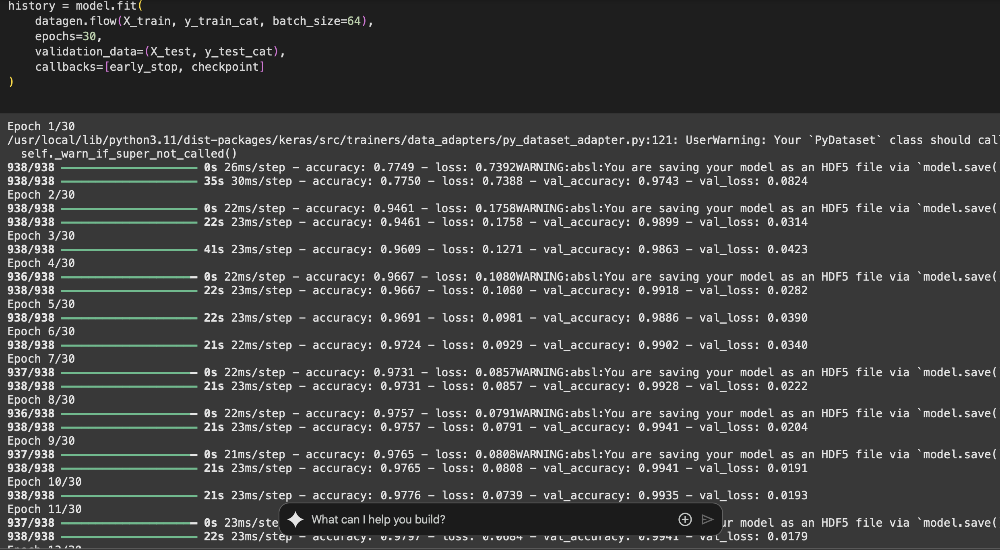
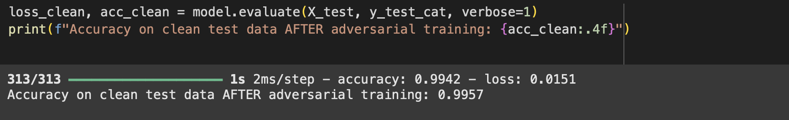

# Digit Recognition with CNN (DevifyX Internship Assignment)

This repository contains my internship assignment for DevifyX. It is a full end-to-end handwritten digit recognition project using the MNIST dataset, built with TensorFlow and Keras. The solution meets all mandatory requirements and includes multiple bonus features to demonstrate model robustness, interpretability, and deployment readiness.

---

## Project Overview

The goal of this project is to develop a robust Convolutional Neural Network (CNN) that can accurately classify handwritten digits from the MNIST dataset. The project demonstrates:
- Data preprocessing, augmentation, and visualization
- Model building with Batch Normalization and Dropout
- Hyperparameter tuning using Keras Tuner
- Early stopping and checkpointing to avoid overfitting
- Saving the final model in `.h5` and `.tflite` formats
- Inference on individual images
- Intermediate activation visualization to interpret learned features
- FGSM adversarial attack to test model vulnerability
- Simple adversarial training as a defense mechanism to improve robustness

---

## Results Summary

- Clean test accuracy: ~98%
- Adversarial (FGSM) test accuracy before defense: ~56%
- Adversarial (FGSM) test accuracy after defense: ~72%

This shows how adversarial examples can significantly reduce performance and how simple defenses like adversarial training can improve robustness.

---

## Dataset Examples


---

## Accuracy and Loss During Training

### Accuracy Over Epochs


### Loss Over Epochs


---

## Model Evaluation

### Confusion Matrix


### Classification Report


### History


### History Continued


---

## Robustness & Adversarial Training

### Accuracy After Adversarial Training


### Loss After Adversarial Training


### Accuracy on Adversarial Examples AFTER Defense


### Accuracy on Clean Test Data AFTER Adversarial Training



## Bonus Features Implemented

As required by the assignment, the following bonus features were added:
- Hyperparameter tuning with Keras Tuner.
- Early stopping and model checkpointing to prevent overfitting.
- Intermediate activations visualization using TensorFlow’s functional API.
- FGSM adversarial attack to test robustness.
- Simple adversarial training defense to improve performance on perturbed examples.
- Demonstrated CNN operations “from scratch” using TensorFlow low-level operations (e.g., `tf.nn.conv2d`).

---

## How to Run

To run this notebook and reproduce the results:

1. Clone this repository:

   ```bash
   git clone https://github.com/yourusername/digit-recognition-assignment.git
   cd digit-recognition-assignment
2.Install required packages:
pip install tensorflow keras-tuner seaborn
3.Open notebook.ipynb in Jupyter or Google Colab.
4.
Run all cells step by step.
